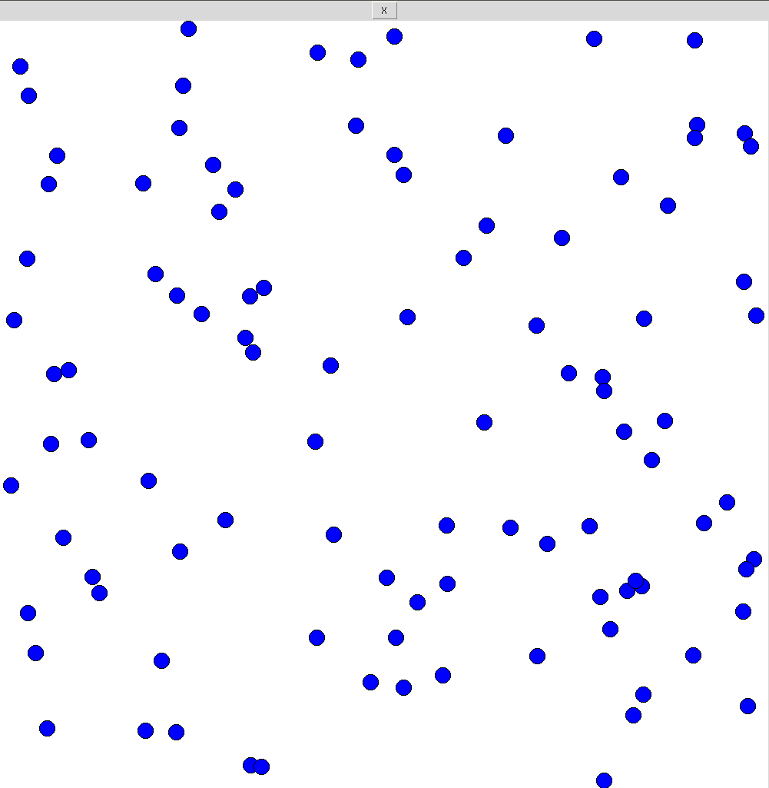
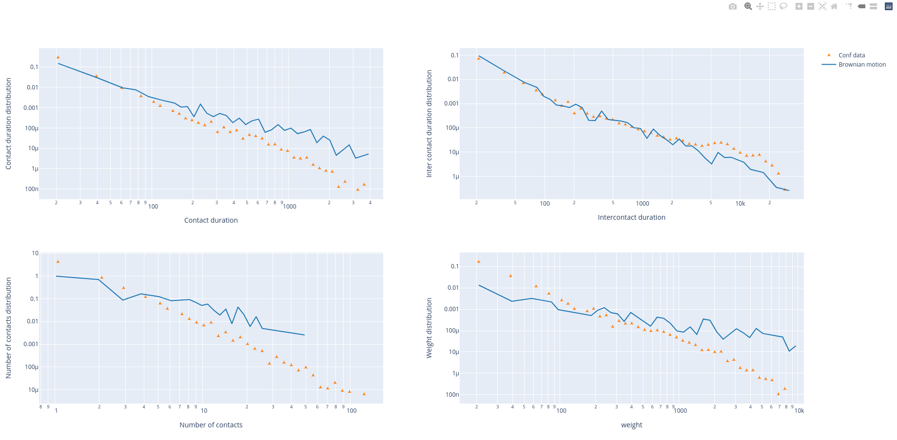

Introduction
============

This library implements several models of human face-to-face interactions in a closed environment. The models range from the brownian motion model to some specific pedestrian models.

=====================
How to run the code ?
=====================

First, you need to choose the model you want to test.
You have four choices (They are all described next):

* Brownian motion.
* Ballistic with stop.
* Vicsek model.
* Pedestrian model.

Then you need to import the wanted class. For example, the following code applies if you want to test the Brownian motion:

.. code-block:: py
   :name: import_example
   
   from brownian import BrownianMotion

Then you need to initialize the class in function of several variables. Many variables are optional. In the case of the Brownian Motion, you need to input two variables: the coefficient of diffusion (diff) and the number of particles (n_particles) in the box. For example, if you want :math:`diff = 0.001` and :math:`n\_particles = 100`: 

.. code-block:: py
   :name: use_model

   brown = BrownianMotion(0.001, 100)

Then, two options are possible:

* Animate the motion
* Get a tij file

Animation
*********

To animate, you have to import the MovementAnimation class and then launch the animation. There is one variable: the class you want to animate.

.. code-block:: py
   :name: animation_example
   
   from animate import MovementAnimation
   
   MovementAnimation(brown)

You should see an animated canvas as shown below:

Tij array
*********

To get the tij array of a model you need to run the following code:

.. code-block:: py
   :name: tij_array_1
   
   brown_tij = brown.total_movement()

To convert a .dat experimental file into a tij_array you need to run the following code:

.. code-block:: py
   :name: tij_array_2
   
   import tij
   
   path = 'tij_ICCSS17.dat'
   tij_array = tij.conversion(path)

Tij interpreter
***************

The timeline function allows to convert the tij data array into a convenient timeline_arary. The interesting data is extracted from the tij_arrays and is represented in four different graphs (Contact time distribution, Intercontact time distribution, number of contacts dsitribution and weight distribution).
One convenient function is the compare_quantities function: it allows to compare your numerical data with experimental data. Here is a code to interpret the data:

.. code-block:: py
   :name: tij_interpret_1
   
   pt = 'tij_conf1.dat'
   tij_array = tij.conversion(pt)
   timeline_array = tij.timeline(tij_array, 20)
   quantities_conf = tij.quantities_calculator(timeline_array)

   brown = BrownianMotion(0.001, 100)
   brown_tij = brown.total_movement()
   timeline_array = tij.timeline(brown_tij, 20)
   quantities_brown = tij.quantities_calculator(timeline_array)

   tij.compare_quantities([quantities_brown, quantities_conf], ['Brownian motion', 'Conf data'],  scale='log')

The output of the code is:

